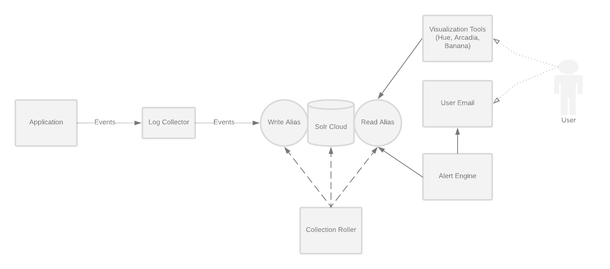

<p align="center">
  


  <h3 align="center"></h3>

  <p align="center">
    Hadoop log aggregation, alerting, and lifecycle management
    <br>

  </p>
</p>

<br>

# Pulse


Table of Contents

* [Intended Audience](#intended-audience)
* [Pulse Features](#pulse-features)
* [Adding an application to Pulse](#adding-an-application-to-pulse)
* [Components](#components)
+ [Architecture Diagram](#architecture-diagram)
* [Installation](#installation)
* [Running the application manually on a cluster](#running-the-application-manually-on-a-cluster)
* [Running tests](#running-tests)
* [Contributing](#contributing)

## Intended Audience

- Running the Cloudera Distribution of Hadoop
- Orchestrating the cluster with Cloudera Manager
  - Comfortable with CSD's
- Support applications on the cluster
- Desire aggregate logging solution for applications
- Turn application logs into actionable data points
  - Build application dashboards
  - Enable custom log search
  - Alert when critical criteria is met
- Comfortable applying Log4j components
- 
## Pulse Features

***Log Aggregation and Search***
- Add log aggregation, search, and alerts to your Java, Scala, Bash, or Python programs and scripts

***Alerting***
- Flexible alerting using the Pulse Alert Engine
- Write alerts using the full solr query syntax. Example alerts:
	- There was an appliction Error in the last 5 minutes
	- My application has stopped logging messages
- Email and web hook integrations

***Log Lifecycle Management***
- Built in rotation of logs.
  - Keep logs for as long as you need them
  - Automatically rotate new log indexes after a configured time period
  - Easily search all logs

***Dashboarding***
- Integration with existing dashboards for rich UIs.

Works with:
- Banana
- Hue Search
- Arcadia Data

***Hadoop Native***
- Pulse uses Solr for document indexing and search and can be deployed on your Hadoop cluster
- Use existing Sentry roles to control access to log data

***Cloudera Manager Integration***
- Simple deployment using CSDs and Parcels
- Manage and monitor Pulse from within Cloudera Manager

## Adding an application to Pulse
If a new application wants to use Pulse, a block should be created in the Collection Roller config.yml
file and the Alert Engine config.yml file. See the [Alert Engine readme](./alert-engine/README.md)
and [Collection Roller readme](./collection-roller/README.md) for more details.

## Components

***Collection Roller***
The collection roller is responsible for creating solr indexes for new applications in Pulse and
deleting old or expired log collections.

***Alert Engine***
The Alert Engine is a daemon process with a set of `alertRules`. Alert rules can be configured
to notify developers and application users when an event happens.

See the [Alerting Engine README](./alert-engine/README.md) for more details and configuration
options.

***Log Collector***
The Log Collector is an HTTP server that receives log messages as JSON and puts them into SOLR
 collections.

See the [Log Collector README](./log-collector/README.md) for more details and configuration
 options.
***Log Appender***
An HTTP log appender for log4j 1.x that will post json messages to the log collector.

See the [Log Appender README](./log-appender/README.md) for more details.

There are also log appenders for Bash and Python in the 'appenders' folder

### Architecture Diagram



## Installation
Pulse can be installed as a Cloudera CSD (Custom Service Descriptor). See [CSD](./cloudera-integration/csd/README.md)
and [PARCEL](./cloudera-integration/parcel/README.md) READMEs for details.

#### Installing the CSD

1. Download the latest CSD jar from [http://downloads.phdata.io/cdh5/csd/](http://downloads.phdata.io/cdh5/csd/)
2. Place the jar in your Cloudera Manager CSD directory, usually `/opt/cloudera/csd`
3. Modify the ownership of the jar `chown cloudera-scm:cloudera-scm /opt/cloudera/csd/pulse-<version>.jar`
4. Restart Cloudera Manager to install the jar

#### Installing the Parcel

1. The parcel repo should be automatically added with the CSD. The url to add it manually:
[downloads.phdata.io/cdh5/parcels/](http://downloads.phdata.io/cdh5/parcels/)
2. Download, distribute, activate the parcel

#### Installing the service

Pulse can be installed through the "Add New Service" button for your cluster.

The wizard will ask you for:
- `smtp user`: This will be the 'from' address for alerts
- `smtp password`: This is only necessary if your smtp server uses authentication
- `smtp address`: The hostname of your smtp server
- `smtp port`: The port of your smtp server


#### Deploying config
Pulse has two configuration files, `collection-roller.yml` and `alert-engine.yml`

Both of these configs are deployed via safety valves. [Alert Engine Example](./example-configs/collection-roller/collection-roller.yml) and [Collection Roller Example](./example-configs/alert-engine/alert-engine.yml)

Place `collection-roller.yml` in `
Collection Roller Advanced Configuration Snippet (Safety Valve) for collection-roller.yml`

Place the `alert-engine.yml` in `
Alert Engine Advanced Configuration Snippet (Safety Valve) for alert-engine.yml`

## Running the application manually on a cluster

Remove the `.template` suffix from these two files under the `bin` directory.
- `cp env.sh.template env.sh`

Change the kerberos keyTab and principal in `jaas.conf` to your own (you need to create one if you don't have it already)

Run individual components:
```bash
$ bin/collection-roller
$ bin/log-collector
$ bin/alert-engine
```

## Running tests
Run all tests from the project root:

```bash
$ make test
```

## Contributing
Sbt is used for building scala, and Make is added to simplify building tasks.

Makefile targets are run with `make <target-name>`, some target examples are like this:

- `dist`: create a distribution (parcel and csd)
- `test`: run all tests
- `package`: create jars from source
- `install`: install parcel and CSD. This is only valid on a node running Cloudera Manager and will install
the csd/parcel to /opt/cloudera/csd and /opt/cloudera/parcel-repo. It will not distribute/activate the parcel
or refresh/install the CSD in Cloudera Manager

Before submitting a pull request, please make sure `make test` and `make dist` both pass successfully.
