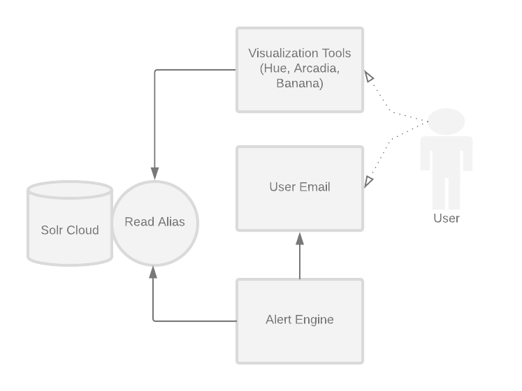

# Alert Engine
An alert engine will run pre-defined queries against application logs, alerting via email if they
return a number of results above or below some threshold. For example, a query could be if an
application has had any error messages in the past hour.

The alert engine will have
- User defined queries
- Send emails to a list of email addresses per query




## Config file
Here's an example of an Alert Engine configuration file:


```yaml

---
applications:
- name: pulse-test-100
  alertRules:
  - query: "timestamp:[NOW-10MINUTES TO NOW] AND level: ERROR"
    retryInterval: 10
    resultThreshold: 0 # If the threshold is set to `-1` it will throw an alert if no results are returned
    alertProfiles:
    - mailProfile1
    alertType: solr # optional, defaults to "solr" when not specified
  emailProfiles:
  - name: mailProfile1
    addresses:
    - address@company.com
  slackProfiles:
  - name: slackProfile1
    url: testurl.com

```
The alert engine takes CLI arguments including a configuration file and zookeeper hosts - because we are using CloudSolrServer to connect to Solr. The solr nodes are stored in Zookkeeper, and this gives things like load balancing for free from the client.

The top-level object of the configuration file is a list of applications.

An application consists of two things, alerts and profiles. Alerts tell the AlertEngine what to alert on. Profiles are used to set up connections to services like email or chat clients. As many profiles can be defined as needed, so you can send alerts through both email and Slack, or any number of services.
An alert rule consists of

- query: A query that acts as a predicate, for example this query Solr: 
`timestamp:[NOW-10MINUTES TO NOW] AND level: ERROR` will trigger an alert if any message with level
 'ERROR' is found within the last 10 minutes. An SQL query must be provided if the `alertType` is `sql`.
- retryInterval: the query will be run on the retry interval. The retry interval is set in minutes
- threshold: if the query returns more than threshold results, an alert will be triggered. The default is 0. If the threshold is set to `-1`, the non-existence of documents with this query will trigger an alert. This is useful for tracking application uptime.
- alertProfiles: One or many alertProfiles can be defined. For each alertProfile defined in an alert, an alertProfile needs to be defined for the application
- alertType: An optional setting which defaults to `solr` when not specified. The valid values are `solr` and `sql`.

## Silenced applications
A silenced application file can be provided `--silenced-application-file silenced-applications.txt`
That contains one line per application that should not alert.

## Running the Alert Engine
A helper script for running the alert engine is located at `bin/alert-engine`.

Example usage of the Alert Engine:
```bash
java -Djava.security.auth.login.config=jaas.conf \
    -cp <path-to-alert-engine-assembly> io.phdata.pulse.alertengine.AlertEngineMain \
    --daemonize --zk-hosts master1.valhalla.phdata.io:2181/solr \
    --smtp-server smtp.gmail.com --smtp-user user@company.com \
    --smtp-port 25 \
    --conf example-configs/alert-engine/alert-engine.yml \
    --silenced-application-file silenced-applications.txt
    --db-url jdbc:mysql://host:port/db
    --db-user some_user
    --db-password some_password
    --db-options "key1=value1;key2=value2"
```
 