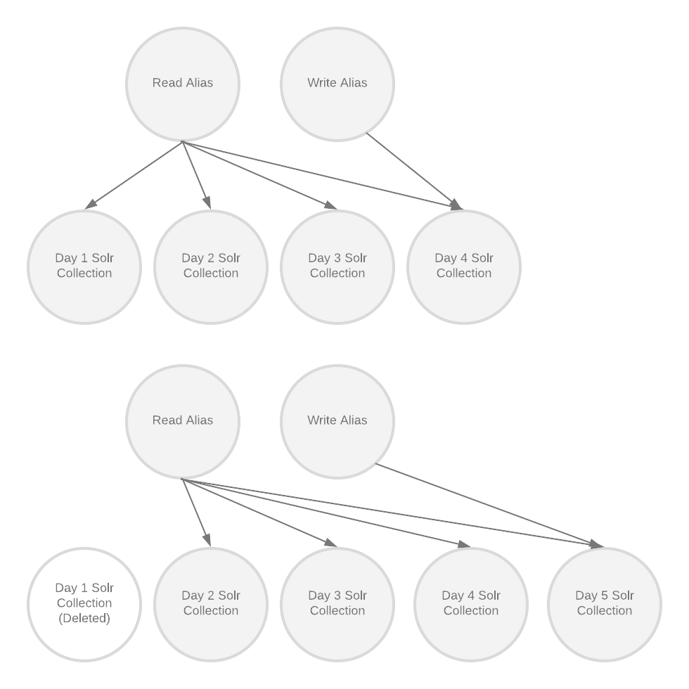

# Collection Roller
The log collector manages log indexes for applications.
An application for the log collector consists of:

- timestamped collections in the format <application_name>_<unixtime_created>. The 'timestamped' 
collections hold the actual log data.
- an alias pointing to the newest timestamped collection called <application_name>_latest. 
The 'latest' alias is used for any applications writing logs (like the Log Collector)
- an alias pointing to all collections called <application>_all. The 'all' alias is used for 
searching all collections



If an application does not exist in Pulse the log collector will create the required aliases and
indexes.
Logs are kept for a limited amount of time (weeks or months). Logs for individual applications will
actually be multiple collections, each covering a time period.

## Rolling
After an application has been created, the collection roller will create new collections for each
day and delete collections older than the configured `numCollections` hold limit.


## Configuration

A Collection Roller configuration file is written in yaml and will look like:

```yaml

solrConfigSetDir: /etc/pulse-logging/solr-configs/ # directory containing one or many solr instancedir configs to be uploaded. The name of the config when uploaded to solr will be the name of the directory
applications:
# Config using all defaults
- name: pulse-test-default
  solrConfigSetName: pulseconfigv2
# Config using options
- name: pulse-test-options
  numCollections: 7 # (optional) number of collections to keep at any given time. Defaults to 7
  shards: 1 # (optional) solr collection shards, defaults to 1
  replicas: 1 # (optional) number of solr config replicas. Defaults to 1
  rollPeriod: 1 # (optional) number of days before the collection is rolled
  solrConfigSetName: pulseconfigv2 # name of solr config to use for the collections

```

At minimum, the configuration needs:

- `solrConfigSetDir`: These Solr configurations can contain customized schema.xml and solrconfig.xml.
The `solrConfigSetDir` can contain multiple configurations. The configurations will be looped over
and uploaded to solr each time the Collection Roller runs.
- `applications`: A list of applications
- The applications must contain at minimum: `name` and `solrConfigSetName`. `name` must be unique. 
`solrConfigSetName` must correspond to the name of a solr config directory in `solrConfigSetDir`

Optional configuration for applications:

- `numCollections`: The number of collections to keep when rolling collections. The default is 7
- `rollPeriod`: Rollperiod in days. Default is 1.
- `shards`: Number of shards for each collection. Default is 1.
- `replicas`: Number of replicas in each collection. Default is 1.

This configuration file is passes as a CLI argument along with a list of zookeeper hosts.

## Running the Collection Roller
A helper script to run the collection roller (mostly used for development) is here
`bin/collection-roller`

To run the collection roller from the command line looks like

```bash
$ java -DXmx=2147483648 \
    -Djava.security.auth.login.config=./jaas.conf \
    -Dsun.security.krb5.debug=false \
    -cp <path-to-collection-roller-assembly> io.phdata.pulse.collectionroller.CollectionRollerMain \
    --daemonize \
    --conf collection-roller.yml \
    --zk-hosts master1.valhalla.phdata.io:2181/solr

```
