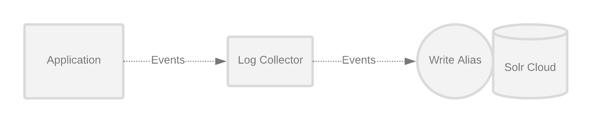

# Log Collector Kafka

The Log Collector Kafka is a kafka consumer that listens for log events, batches them, and writes them
into a Solr Cloud cluster. Log Collector Kafka is using Logstash to deliver the log events from the application
to a given kafka producer.

# 

Example usage:

```bash
    java -cp <log-collector-jar> io.phdata.pulse.logcollector.LogCollector \
    --zk-hosts $ZK_QUORUM \
    --consume-mode kafka \
    --kafka-properties $KAFKA_PROPS \
    --topic $KAFKA_TOPIC
```


Sample JSON event:

```json
  {
  "category":"io.phdata.pulse.log.HttpAppenderTest",
  "timestamp": "YYYY-MM-DDTHH:mm:ss.sssZ",
  "level":"INFO",
  "message":"Hello, World",
  "threadName":"main",
  "ndc":"ndc",
  "properties":{"key":"value"},
  "thrown":["java.lang.Throwable: Test","\tat io.phdata.pulse.log.HttpAppenderTest.testRenderJson(HttpAppenderTest.java:24)","\tat sun.reflect.NativeMethodAccessorImpl.invoke0(Native Method)","\tat sun.reflect.NativeMethodAccessorImpl.invoke(NativeMethodAccessorImpl.java:62)","\tat sun.reflect.DelegatingMethodAccessorImpl.invoke(DelegatingMethodAccessorImpl.java:43)","\tat java.lang.reflect.Method.invoke(Method.java:498)","\tat org.junit.runners.model.FrameworkMethod$1.runReflectiveCall(FrameworkMethod.java:50)","\tat org.junit.internal.runners.model.ReflectiveCallable.run(ReflectiveCallable.java:12)","\tat org.junit.runners.model.FrameworkMethod.invokeExplosively(FrameworkMethod.java:47)","\tat org.junit.internal.runners.statements.InvokeMethod.evaluate(InvokeMethod.java:17)","\tat org.junit.runners.ParentRunner.runLeaf(ParentRunner.java:325)","\tat org.junit.runners.BlockJUnit4ClassRunner.runChild(BlockJUnit4ClassRunner.java:78)","\tat org.junit.runners.BlockJUnit4ClassRunner.runChild(BlockJUnit4ClassRunner.java:57)","\tat org.junit.runners.ParentRunner$3.run(ParentRunner.java:290)","\tat org.junit.runners.ParentRunner$1.schedule(ParentRunner.java:71)","\tat org.junit.runners.ParentRunner.runChildren(ParentRunner.java:288)","\tat org.junit.runners.ParentRunner.access$000(ParentRunner.java:58)","\tat org.junit.runners.ParentRunner$2.evaluate(ParentRunner.java:268)","\tat org.junit.runners.ParentRunner.run(ParentRunner.java:363)","\tat org.junit.runner.JUnitCore.run(JUnitCore.java:137)","\tat com.intellij.junit4.JUnit4IdeaTestRunner.startRunnerWithArgs(JUnit4IdeaTestRunner.java:68)","\tat com.intellij.rt.execution.junit.IdeaTestRunner$Repeater.startRunnerWithArgs(IdeaTestRunner.java:47)","\tat com.intellij.rt.execution.junit.JUnitStarter.prepareStreamsAndStart(JUnitStarter.java:242)","\tat com.intellij.rt.execution.junit.JUnitStarter.main(JUnitStarter.java:70)"]
  }
```


Sample Kafka configuration file:

```bootstrap.servers=localhost:9093
   key.deserializer=org.apache.kafka.common.serialization.StringDeserializer
   value.deserializer=org.apache.kafka.common.serialization.StringDeserializer
   auto.offset.reset=earliest
   group.id=pulse-log-collector
   security.protocol=SASL_SSL
   sasl.kerberos.service.name=kafka
   ssl.truststore.location=/opt/cloudera/security/pki/jks/local.jks
   ssl.truststore.password=1234
```


## Setup
An example Logstash configuration file (logstash-kafka.conf) is supplied in the logstash-conf folder. It takes input from a log file that is appended to via the log4j.properties file for the Spark application.
The logs are then placed on a Kafka topic configured in logstash-kafka.conf. When kafka mode is turned on, the Log Collector acts as the kafka consumer and routes the log messages to Solr.

## Configuration
The log collector will batch up messages over a period of time before sending them to Solr.
The batch size, duration, and max buffer size are configurable via java options:

- `pulse.collector.stream.buffer.max`: Max number of messages to be kept in the log collector buffer
before new messages are dropped.  This buffer can grow and become full if Solr is overloaded. Default is 512000 messages.
- `pulse.collector.stream.batch.size`: Size of the batches to send to solr. Default is 1000 messages
- `pulse.collector.stream.flush.seconds`: Number of seconds to wait before flushing documents to solr. Default is 1 second
- `pulse.collector.stream.overflow.strategy`: [OverflowStrategy](https://monix.io/api/2.3/monix/reactive/OverflowStrategy$.html)
Valid overflow strategies are `fail`, `dropold`, `dropnew`, `clearbuffer`, `backpressure`
 to employ if the buffer has reached its max size. Options are 'dropnew', 'drophead', 'droptail', 'backpressure', and 'dropbuffer'. Defaults to `fail`
- `pulse.collector.stream.numthreads`: Number of threads used to write messages to Solr in parallel. Default is 1