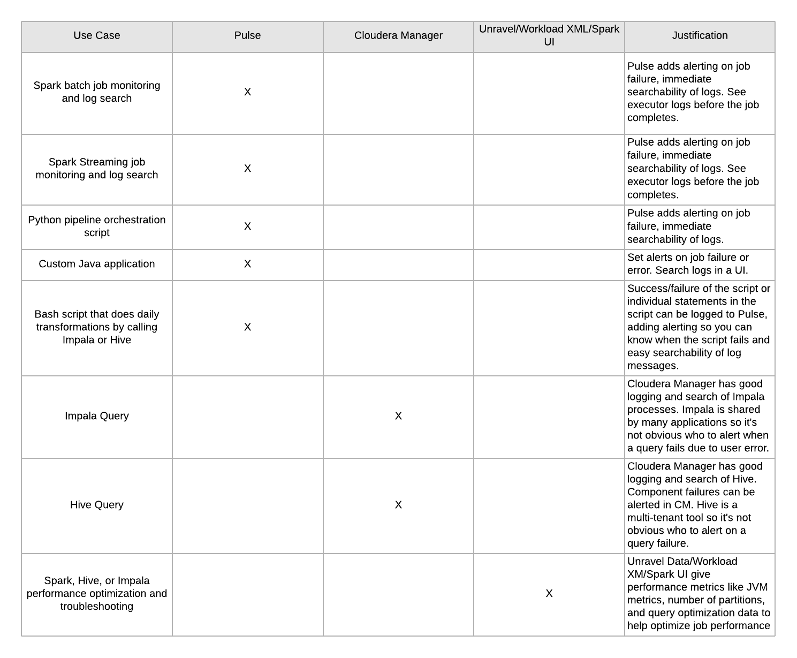
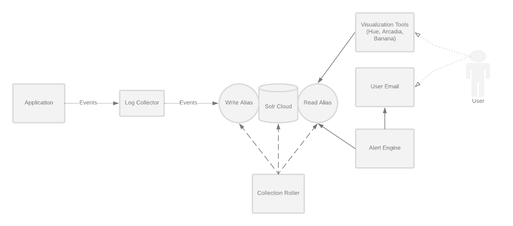

# Overview

## Intended Audience

Pulse is intended for users with:

- A need for log aggregation for Spark, Java, Python, or Bash applications or scripts 
- An existing Hadoop Cluster

## License
Pulse is [Apache 2.0](https://www.apache.org/licenses/LICENSE-2.0) Licensed 

## System Requirements

- A Solr Cloud installation
- Java 1.8
- A Cloudera Manager managed cluster is recommended but not required

## Features

***Log Aggregation and Search***
- Add log aggregation, search, and alerts to your Java, Scala, Bash, or Python programs and scripts

***Alerting***

- Flexible alerting using the Pulse Alert Engine
- Write alerts using the full solr query syntax. Example alerts:
	- There was an appliction Error in the last 5 minutes
	- My application has stopped logging messages
- Email and web hook integrations

***Log Lifecycle Management***

- Built in rotation of logs.
  - Keep logs for as long as you need them
  - Automatically rotate new log indexes after a configured time period
  - Easily search all logs

***Dashboarding***

- Integration with existing dashboards for rich UIs.

Visualization and search works with:

- Hue Search
- Arcadia Data
- Banana

***Hadoop Native***

- Pulse uses Solr for document indexing and search and can be deployed on your Hadoop cluster
- Use existing Sentry roles to control access to log data

***Cloudera Manager Integration***

- Simple deployment using CSDs and Parcels
- Manage and monitor Pulse from within Cloudera Manager

Pulse is used for centralized logging. This diagram compares Pulse to other tools given use cases:



## Components

***Collection Roller***
The collection roller is responsible for creating solr indexes for new applications in Pulse and
deleting old or expired log collections.

***Alert Engine***
The Alert Engine is a daemon process with a set of `alertRules`. Alert rules can be configured
to notify developers and application users when an event happens.

See the [Alerting Engine](alerting-engine) for more details and configuration
options.

***Log Collector***
The Log Collector is an HTTP server that receives log messages as JSON and puts them into SOLR
 collections.

See the [Log Collector](log-collector) for more details and configuration
 options.
***Log Appender***
An HTTP log appender for log4j 1.x that will post json messages to the log collector.

See the [Log Appender](log-appender) for more details.

There are also log appenders for Bash and Python in the 'appenders' folder

### Architecture Diagram



## Installation
Pulse can be installed as a Cloudera CSD (Custom Service Descriptor). See [CSD](csd)
and [PARCEL](parcel) READMEs for details.

#### Installing the CSD

1. Download the latest CSD jar, see versions list below
2. Place the jar in your Cloudera Manager CSD directory, usually `/opt/cloudera/csd`
3. Modify the ownership of the jar `chown cloudera-scm:cloudera-scm /opt/cloudera/csd/pulse-<version>.jar`
4. Restart Cloudera Manager to install the jar

#### Installing the Parcel

1. The parcel repo should be automatically added with the CSD. The url to add it manually:
2. Download, distribute, activate the parcel

Versions: 
(Note, CSDs are included in the parcel repo)

- 2.1.0: 

#### Installing the service

Pulse can be installed through the "Add New Service" button for your cluster.

The wizard will ask you for:
- `smtp user`: This will be the 'from' address for alerts
- `smtp password`: This is only necessary if your smtp server uses authentication
- `smtp address`: The hostname of your smtp server
- `smtp port`: The port of your smtp server

#### Deploying config
Pulse has two configuration files, `collection-roller.yml` and `alert-engine.yml`

Both of these configs are deployed via safety valves. [Alert Engine Example](alerting-engine) and [Collection Roller Example](collection-roller)


Place `collection-roller.yml` in `
Collection Roller Advanced Configuration Snippet (Safety Valve) for collection-roller.yml`

Place the `alert-engine.yml` in `
Alert Engine Advanced Configuration Snippet (Safety Valve) for alert-engine.yml`

#### Configuring Sentry for Solr

If Sentry is enabled for Solr, roles and grants will need to be configured for Pulse and for each Pulse application.  

Add the pulse group to the Solr admin role.  This assumes Sentry for Solr has been configured with an admin role.  This step only needs to be done once after install.  The example below assumes your admin role is named `solradmin`.
- `solrctl sentry --add-role-group solradmin pulse`

Create the role and grant for each application.  In this example, `sample_role` is the name of the Solr role granting query privileges to the collection `sample-app_all` for the Pulse application `sample-app`.  The `sample-group` group is added to that role.  
- `solrctl sentry --create-role sample_role`
- `solrctl sentry --grant-privilege sample_role 'collection=sample-app_all->action=Query'`
- `solrctl sentry --add-role-group sample_role sample_group`

## Running the application manually on a cluster

Run `make package` which will collect all the jars into `target/lib`.

Remove the `.template` suffix from these two files under the `bin` directory.
- `cp env.sh.template env.sh`

Change the kerberos keyTab and principal in `jaas.conf` to your own (you need to create one if you don't have it already)

Run individual components:

```bash
$ bin/collection-roller
$ bin/log-collector
$ bin/alert-engine
```

## Running tests
Run all tests from the project root:

```bash
$ make test
```

## Contributing
Sbt is used for building scala, and Make is added to simplify building tasks.

Makefile targets are run with `make <target-name>`, some target examples are like this:

- `dist`: create a distribution (parcel and csd)
- `test`: run all tests
- `package`: create jars from source
- `install`: install parcel and CSD. This is only valid on a node running Cloudera Manager and will install
the csd/parcel to /opt/cloudera/csd and /opt/cloudera/parcel-repo. It will not distribute/activate the parcel
or refresh/install the CSD in Cloudera Manager

Before submitting a pull request, please make sure `make test` and `make dist` both pass successfully.
