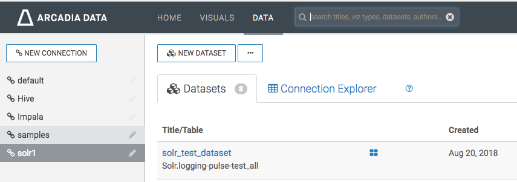
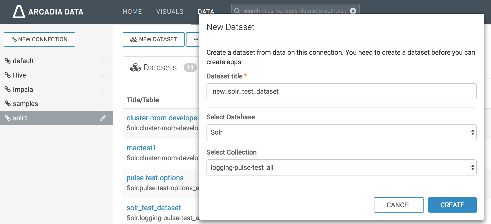
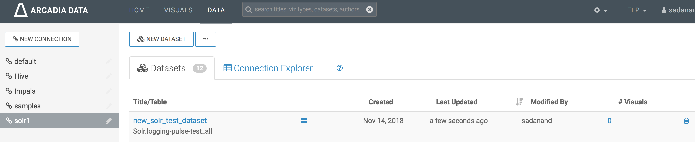
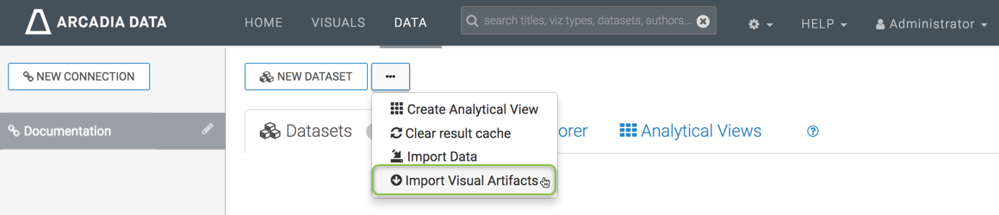
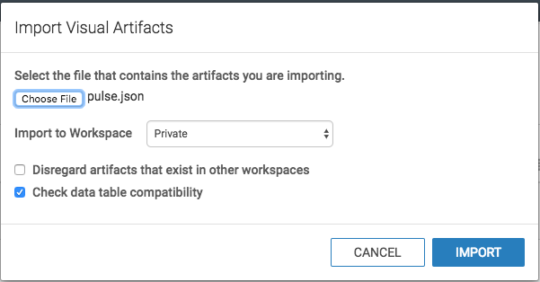
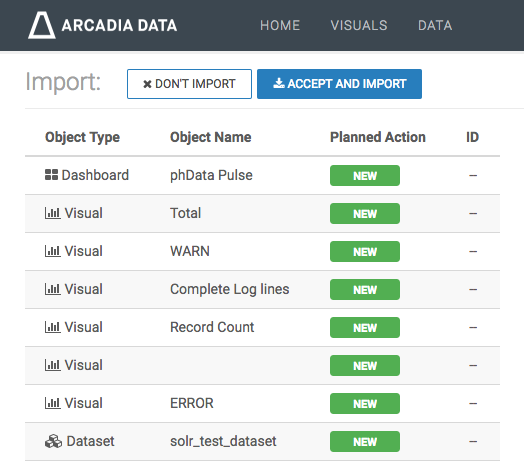
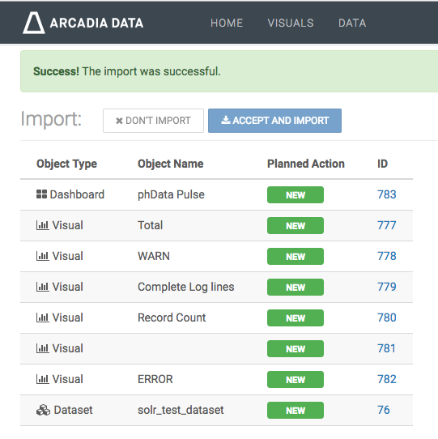
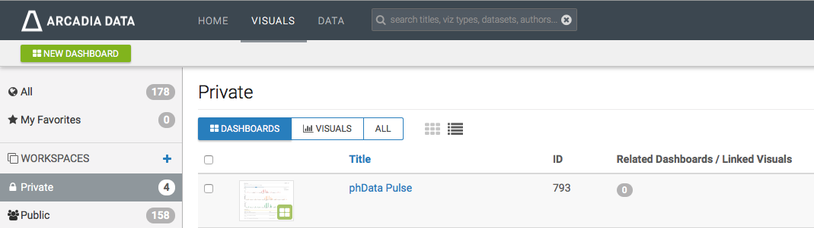
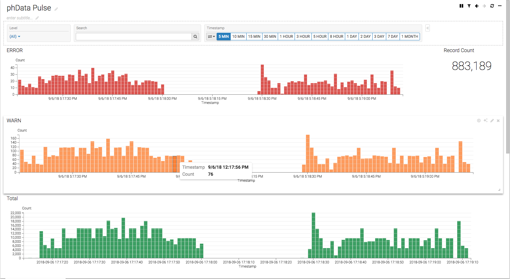

# Visualization

Pulse uses Solr, which can use several Visualization tools, including Hue and Arcadia Data.

## Pulse Data Visualization using Arcadia

Arcadia is visual analytics and BI software that runs natively within modern data platforms such as
Apache Hadoop and the cloud. Read [here](https://www.arcadiadata.com) for more information.

### Data visualization using sample arcadia dashboard extract `pulse.json`

#### Create new solr connection

- If Solr connection is not existing in Arcadia Data, create one using this link
[Creating New Apache Solr Connection](http://documentation.arcadiadata.com/4.3.0.0/#pages/topics/conn-solr.html)

### Create new dataset

- Sign into Arcadia
- Click on `DATA`

- Go to `solr` connection created in the previous steps and click on `NEW DATASET`

- Enter your Dataset title, use `solr` as database and finally select the solr collection that you want

- Click `CREATE`
- You should be able to see the new dataset created

### Replace dataset_name and dataset_detail from `pulse.json`

The `replace-dataset-name.sh` script can be found in the `visualizations/arcadia` folder.

- Use `replace-dataset-name.sh` script to replace dataset_name and dataset_detail with the dataset name and Solr index name of your own dataset
- command `./replace-dataset-name.sh my_dataset_name Solr.my_application_all`
- `dashboard.json` is ready to be imported

### Importing dashboard

- Refer to below screenshots while following the [import dashboard](http://documentation.arcadiadata.com/4.3.0.0/#pages/topics/import-dash.html) document

- Click on import visual artifacts

- Choose `pulse.json` file and click on `import`

- Click on `Accept and Import`, also check `dataset` at the bottom

- Make sure success message appeared on window

- Look for phData Pulse dashboard in visuals private as shown below.

- Lastly examine the dashboard and functionality of filters. The dashboard will look similar to below screenshot.

