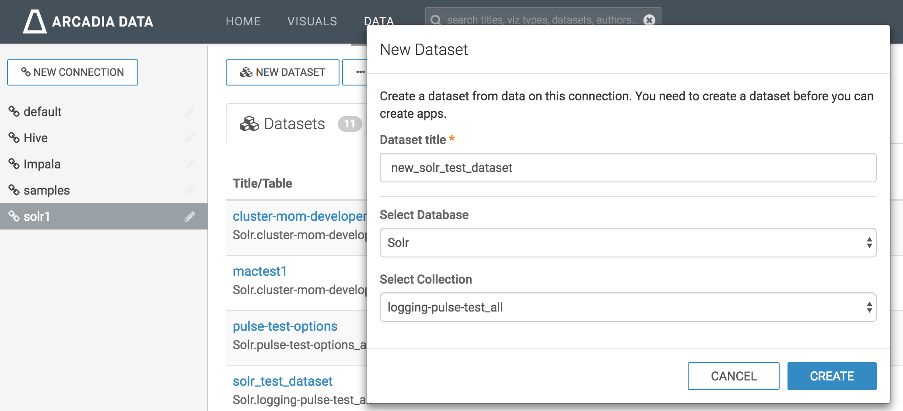
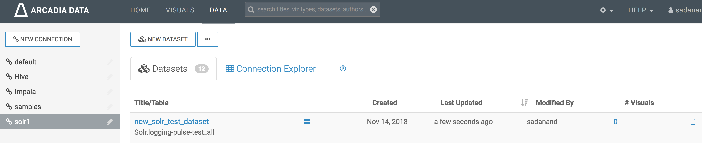

# Pulse Data Visualization using Arcadia
- Visualizing pulse data using Arcadia
- Arcadia is the first visual analytics and BI software that runs natively within modern data platforms such as Apache Hadoop and the cloud
- Read [here](https://www.arcadiadata.com) for more information

## Data visualization using sample arcadia dashboard extract `pulse.json`

### Create new solr connection
- If Solr connection is not existing in Arcadia Data, create one using this link [Creating New Apache Solr Connection](http://documentation.arcadiadata.com/4.3.0.0/#pages/topics/conn-solr.html)

### Create new dataset
- Sign into Arcadia
- Click on `DATA`

- Go to `solr` connection created in the previous steps and click on `NEW DATASET`

- Enter your Dataset title, use `solr` as database and finally select the solr collection that you want

- Click `CREATE`
- You should be able to see the new dataset created

### Replace `dataset_name` from `pulse.json`
- Use `replace_dataset_name.sh` script to replace dataset_name in pulse.json with new dataset_name created in the last step
- command `./replace_dataset_name.sh pulse.json new_dataset_name`
- `pulse.json` is ready to be imported

### Importing dashboard
- Refer to below screenshots while following the [import dashboard](http://documentation.arcadiadata.com/4.3.0.0/#pages/topics/import-dash.html) document

- Click on import visual artifacts

- Choose `pulse.json` file and click on `import`

- Click on `Accept and Import`, also check `dataset` at the bottom

- Make sure success message appeared on window

- Look for phData Pulse dashboard in visuals private as shown below.

- Lastly examine the dashboard and functionality of filters. The dashboard will look similar to below screenshot.

