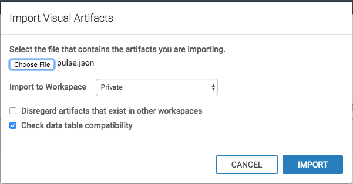

# Arcadia Data

## Importing Dashboard

In Arcadia Enterprise, you can import dashboards exported from another system. 
All you need is appropriate JSON file that captures the definitions of these visual artifacts and all their dpendencies (such as datasets and custom styles).

1. Click **Data** in the top navigation menu
2. Select the connection(`Apache Solr connection`), where to import the artifacts.\
We selected **Solr1**, because that is name of our solr connection created in Arcadia.
3. At the top of the screen, click the  (supplemental) menu.
4. In the  (supplemental) menu, click the **Import Visual Artifacts** option.\
\

5. The **Import Visual Artifacts** window modal appears.
6. Click **Choose File**.\
\

7. Select the exported dashboard JSON file in your file system. Here, we are getting `pulse.json`, the file created in [Exporting Dashboards](http://documentation.arcadiadata.com/4.3.0.0/pages/topics/export-dash.html#export-dash).\
\

8. In the updated **Import Visual Artifacts** modal, notice the three import options:

    * **Import to Workspace** (Private by default)\
    The drop-down menu enables you to specify the destination workspace. By default, Arcadia Enterprise imports the visual artifacts into the user's Private workspace.

    * **Disregard artifacts that exist in other workspaces** (Off by default)\
    Before importing an artifact, Arcadia Enterprise searches for it on the system. If it already exists, it is either updated (if changed from a previous import), or left 'as is'. If it does not exist, it is imported as a new visual artifact.\
    \
    By default, the search domain is the entire system. By selecting this option, you are limiting the search to the specified workspace.

    * **Check data table compatibility** (On by default)\
    This is a 'sanity check' that confirms that tables suitable for the incoming dataset(s) exist on the system. This means that the database and tables have the same names on the source and target systems.\
   After making the appropriate selections, click **Import**.\
   \
   
9. After processing the import `pulse.json` file, Arcadia Enterprise opens the Import interface to show its visual artifacts. Here, it displays the eight visuals and the dataset that used for creating dashboard.
\
Notice also that the **Planned Action** column shows that this is a new import for all artifacts. At this point, none of them have an assigned ID.\
\
Click **Accept and Import**.\
\

10. After the import completes, a **Success** message appears on the **Import** interface.\
\
Notice that all the artifacts have an assigned ID. These are generated by the system, sequentially. Visuals/Dashboards and datasets have separate id queues.\
\

11. To confirm that the visuals are imported successfully, click **Visuals** in the top navigation, select the appropriate workspace (in this case, Private), and then select **Dashboards** in top navigation.\
\
In the list view of the catalog, the dashboard appears at the top of the list; note its ID generated by the new system. Notice also that you can confirm the dataset and connection names that the dashboard uses, both in the **Dataset** column, and the .
\

12. Lastly, if you examine the same visual in edit mode, you can confirm that it is not part of any dashboard in the new system.
\

13. Dataset connections, Solr collection table names, Visuals are all editable for customization.