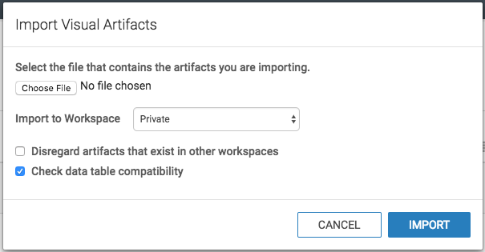

# Arcadia Data

## Importing Dashboard

In Arcadia Enterprise, It is possible to import dashboards exported from another system. 
All we need is appropriate JSON file that captures the definitions of all visual artifacts and all their dpendencies (such as datasets, visuals, and custom styles).

1. Click on **Data** in the top navigation menu.
2. Select the Solr connection(`Apache Solr connection`) to import the artifacts.\
\
If there is no existing Apache Solr connection, please follow this [Apache Solr connection](http://documentation.arcadiadata.com/4.3.0.0/#pages/topics/conn-solr.html) document to create one.\
\
We have selected **Solr1** named connection here, because that is the example name provided to our solr connection created in Arcadia.\

3. At the top of the screen, click the  (supplemental) menu as shown in following diagram. But make sure you are within Solr connection.\

4. In the  (supplemental) menu, look for **Import Visual Artifacts** option and click on it.\
\

5. The **Import Visual Artifacts** window modal appears.
6. Click **Choose File**.\
\

7. Select the exported dashboard JSON file from pulse application visualization directory. Here, we are getting `pulse.json`, the file created by [Exporting Dashboards](http://documentation.arcadiadata.com/4.3.0.0/pages/topics/export-dash.html#export-dash). Follow the link for more information on how to export dashboards.\
\

8. In the updated **Import Visual Artifacts** modal, notice the three import options:

    * **Import to Workspace** (Private by default)\
    The drop-down menu enables you to specify the destination workspace. By default, Arcadia Enterprise imports the visual artifacts into the user's Private workspace.

    * **Disregard artifacts that exist in other workspaces** (Off by default)\
    Before importing an artifact, Arcadia Enterprise searches for it on the system. If it already exists, it is either updated (if changed from a previous import), or left 'as is'. If it does not exist, it is imported as a new visual artifact.\
    \
    By default, the search domain is the entire system. By selecting this option, you are limiting the search to the specified workspace.

    * **Check data table compatibility** (On by default)\
    This is a 'sanity check' that confirms that tables suitable for the incoming dataset(s) exist on the system. This means that the database and tables have the same names on the source and target systems.\
   After making the appropriate selections, click **Import**.\
   \
   
9. After importing `pulse.json` file, Arcadia Enterprise opens the Import interface to show its visual artifacts. Here, it displays the eight visuals and the dataset that used for creating dashboard.
\
Notice that the **Planned Action** column shows that this is a new import for all artifacts, none of them have an assigned ID yet.\
\
Click on **Accept and Import**.\
\

10. After the import completes, look for the **Success** message appears on the **Import** interface.\
\
Notice that now all the artifacts have an assigned ID. These are automatically generated by the system, sequentially.\
\

11. To confirm that the visuals are imported successfully, click **Visuals** in the top navigation, select the appropriate workspace (under Private), and then select **Dashboards** in top navigation.\
\
In the list view of the catalog, look for `phData Pulse` dashboard. Make sure that dashboard got generated with some random assigned Id. Now confirm the dataset and connection names that the dashboard has are as expected.
\

12. Dataset connections, Solr collection table names, Visuals are all customizable.
13. To confirm that the Dataset imported successfully, Click Data in the top navigation menu. Now you can see `solr_test_dataset` got created.\
\

14. Click on solr_test_dataset and explore the options.\
\
\
Use edit button to change Dataset, Data connection, Table names to desired. Change connection type to solr connection you have created previously. Change the table name to solr collection `solr.<collection name>` where you are storing the logs captured by **Pulse** log-collector.\
\
\
\
Change the Solr collection name from `logging-pulse-test` to desired collection name in you solr database.
\

15. Lastly examine the dashboard visual in edit mode, you can confirm that it is not part of any dashboard in the new system.
\
